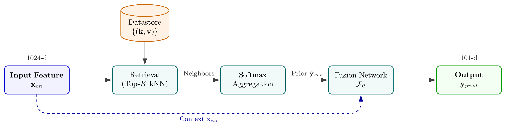
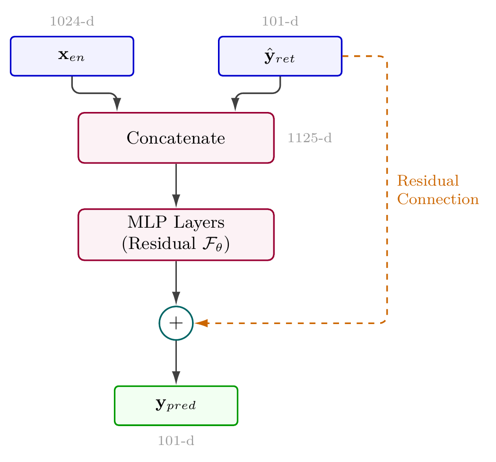

# Interspeech 2026 TOPI S2ST Challenge: RAPM

**RAPM：音声翻訳のための検索拡張型語用特徴マッパー**

[English](README.md) | [简体中文](README.zh-CN.md)

## 著者

**Xiaoyang Luo**、**Siyuan Jiang**、**Shuya Yang**、**Dengfeng Ke**、**Yanlu Xie**、**Jinsong Zhang**（連絡著者）

Speech Acquisition and Intelligent Technology Laboratory (SAIT LAB)

Beijing Language and Culture University（北京語言大学）、中国・北京

## 論文と概要

[最新版の論文 PDF](InterspeechPaperRAPM.tex.pdf)。著者と所属を表示し、Translatotron 2 の引用を修正した版です。

論文タイトル：**RAPM: Retrieval-Augmented Pragmatic Mapper for Speech-to-Speech Translation**。

RAPM は英語からスペイン語への語用意図と韻律の転移を扱います。1024 次元の英語 HuBERT 特徴量から、対応するスペイン語の事例を検索し、`spanish_winners` で選択した 101 次元の語用特徴を予測します。検索のみの方式と、残差融合ネットワークを加えた方式を比較します。

Config A は英語の 1024 次元空間全体で検索し、Config B は `english_winners` で選択した 103 次元部分空間で検索します。どちらもスペイン語の全特徴量を取得してから、出力用の 101 次元を選択します。融合ネットワークは元の 1024 次元英語入力と 101 次元の検索事前情報を連結し、LayerNorm と GELU を用いた `1125 → 256 → 128 → 101` の MLP で残差を学習します。最終予測は検索事前情報と残差補正の和です。

## 主な結果

以下は論文で報告された 10 回の実行の平均値で、標準偏差は ±0.002 です。融合による改善量は絶対差を示します。

| システム | 検索次元 | 内部評価：既知話者 | 融合による改善 | 公式評価：未知話者 | 融合による改善 |
|---|---:|---:|---:|---:|---:|
| Baseline MLP | — | 0.8732 | — | **0.8574** | — |
| Config A: 検索のみ | 1024 | 0.8722 | — | 0.8286 | — |
| Config A: 検索 + 融合 | 1024 | **0.8742** | +0.0020 | 0.8290 | +0.0004 |
| Config B: 検索のみ | 103 | 0.8730 | — | 0.8318 | — |
| Config B: 検索 + 融合 | 103 | 0.8741 | +0.0011 | **0.8331** | +0.0013 |

Config B は RAPM の中で最良の公式評価結果を得ますが、MLP ベースラインを 0.0243 下回ります。公式テストの話者 5 名のうち 4 名は訓練コーパスに含まれません。内部テストは訓練と話者を共有するため、この二つの評価条件を区別する必要があります。

### 融合入力のアブレーション

最新版の論文では、以下を**既知話者の内部テスト**での結果として報告しています。公式ブラインドテストの結果ではありません。

| 融合入力 | 入力次元 | コサイン類似度 |
|---|---:|---:|
| 元の融合：英語の文脈 + 検索事前情報 | 1125 | **0.8741** |
| 検索のみのベースライン | — | 0.8730 |
| 事前情報のみの補正 | 101 | 0.8683 |
| 同一部分空間での融合 | 204 | 0.8660 |

この実験では、入力する原言語の文脈を制限すると既知話者での性能が低下します。これらの数値は未知話者での改善を示すものではありません。個別の実験スクリプトから論文の表を再現する際は、コードとデータ分割を確認してください。

## アーキテクチャ





論文ではコサイン検索、`K=70`、温度 `0.04` を使用します。融合の訓練は最大 100 エポックで、AdamW、学習率 `1e-3`、重み減衰 `1e-4`、バッチサイズ 32、コサイン埋め込み損失を用います。検証、早期終了、評価の詳細は PDF を参照してください。リポジトリ内の各スクリプトでは訓練手順が異なる場合があります。

## インストールとデータ準備

```bash
git clone https://github.com/TheGrSun/Interspeech2026-TOPI-RAPM.git
cd Interspeech2026-TOPI-RAPM
pip install -r requirements.txt
git clone https://github.com/mdekorte/Pragmatic_Similarity_Computation.git official_mdekorte
```

ベースラインのリポジトリは、実験に必要な `feature_selection.py` と公式ファイルリストを提供します。これは外部依存であり、Git サブモジュールとしては設定されていません。[DRAL データセット](https://www.cs.utep.edu/nigel/dral/)を入手し、対応する `EN_*.npy` / `ES_*.npy` 特徴量を `dral-features/features/` に配置してください。ファイル名順で両言語が正しく対応する必要があります。現在の Git ツリーにはデータ特徴量と学習済み `.pth` 重みは含まれていません。

## コードの実行

データとベースラインの依存ファイルを準備してから、リポジトリのルートで実行します。

```bash
python src/train_ensemble.py --mode 103_fusion --data_dir dral-features/features --checkpoint_dir checkpoints --top_k 70 --temperature 0.04 --hidden_dims 256 128 --epochs 100 --lr 0.001 --batch_size 32 --device cuda
```

CPU を使用する場合は `--device cpu` に変更してください。他のモードは `1024_fusion`、`1024_pure`、`103_pure`、`all` です。このスクリプトは指定したディレクトリの特徴量で訓練し、訓練データのコサイン類似度を報告します。独立したテスト評価ではありません。

ベースラインの訓練・テストファイルリストを使った比較には、次のスクリプトを使用します。

```bash
python src/compare_all_models_official_split.py
```

実行前にスクリプトの特徴量パスとファイルリストを確認してください。ベースラインのファイルリストによる分割は内部評価用であり、チャレンジの公式ブラインドテストとは異なります。現在の Git ツリーには独立した `src/evaluate.py` や提出ファイル生成スクリプトはありません。

## リポジトリ構成

| パス | 内容 |
|---|---|
| `InterspeechPaperRAPM.tex.pdf` | 著者・所属を含む最新版の論文 |
| `src/` | 訓練、比較、アブレーションのスクリプト |
| `experiments/` | その他の実験スクリプト |
| `scripts/` | アンサンブル訓練とハイパーパラメータ探索 |
| `config/` | 設定例。パスとスクリプトとの互換性を確認してください |
| `checkpoints/` | 重みの説明文書。重みはバージョン管理されていません |
| `docs/images/` | 構成図 |

## 引用

本システム記述原稿の引用には、以下の項目を使用できます。

```bibtex
@misc{luo2026rapm,
  title={{RAPM: Retrieval-Augmented Pragmatic Mapper for Speech-to-Speech Translation}},
  author={Luo, Xiaoyang and Jiang, Siyuan and Yang, Shuya and Ke, Dengfeng and Xie, Yanlu and Zhang, Jinsong},
  year={2026},
  howpublished={Interspeech 2026 TOPI Challenge system-description manuscript},
  url={https://github.com/TheGrSun/Interspeech2026-TOPI-RAPM}
}
```

## ライセンスと謝辞

[MIT License](LICENSE)。Interspeech 2026 TOPI S2ST Challenge の主催者、DRAL データセットの作成者、ベースライン実装の著者に感謝します。
