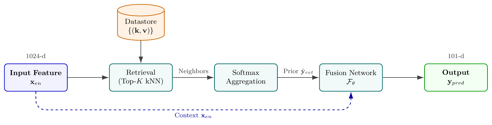
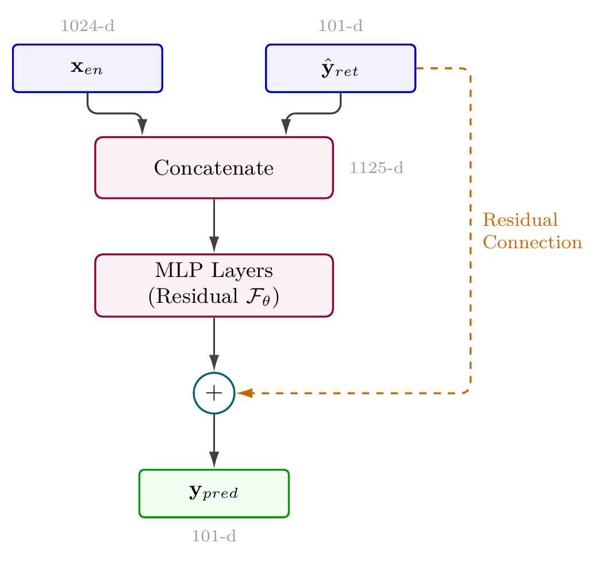

# Interspeech 2026 TOPI S2ST Challenge: R-APM

**检索增强的语用映射器用于跨语言韵律迁移**

[English](README.md) | [日本語](README.ja.md)

---

## 作者

**Xiaoyang Luo**，**Siyuan Jiang**，**Shuya Yang**，**Dengfeng Ke**，**Yanlu Xie**，**Jinsong Zhang**

语音获取与智能技术实验室 (SAIT LAB)
北京语言大学，北京，中国

---

## 概述

R-APM 是一个基于检索的跨语言韵律迁移系统，从英语 HuBERT 特征（1024维）预测西班牙语韵律特征（101维），采用混合检索+融合架构。

> **📄 论文**: [InterspeechPaperRAPM.tex.pdf](InterspeechPaperRAPM.tex.pdf) - Interspeech 2026 TOPI Challenge 系统描述

## 主要结果

| 系统 | 检索维度 | 内部(见过) 余弦相似度 | 提升 | 官方(未见) 余弦相似度 | 提升 |
|--------|----------|---------------------|------|---------------------|------|
| **Baseline MLP** | - | 0.8732 | - | **0.8574** | - |
| **Config A: High-Res** | | | | | |
| ─ Pure Ret | 1024 | 0.8722 | - | 0.8286 | - |
| ─ Ret + Fusion | 1024 | **0.8742** | +0.0020 | 0.8290 | +0.0004 |
| **Config B: Subspace** | | | | | |
| ─ Pure Ret | 103 | 0.8730 | - | 0.8318 | - |
| ─ Ret + Fusion | 103 | 0.8741 | +0.0011 | **0.8331** | +0.0013 |

> **注意**: 内部分割使用官方训练/测试文件列表。Config B（103维子空间）在包含未见说话人的官方测试集上取得最佳性能。

## 架构

### 系统架构

**图 1: R-APM 系统架构**



### 融合网络设计

**图 2: 带残差连接的融合网络**



## 安装

```bash
git clone --recurse-submodules https://github.com/TheGrSun/Interspeech2026-TOPI-RAPM.git
cd Interspeech2026-TOPI-RAPM
pip install -r requirements.txt
```

## 使用方法

```bash
# 训练
python src/train.py --config config/default.yaml

# 评估
python src/evaluate.py --checkpoint checkpoints/best_model.pth

# 生成提交
cd submit
python generate_submission.py
```

## 数据集

从以下地址下载 DRAL 数据集: https://www.cs.utep.edu/nigel/dral/

## 引用

```bibtex
@inproceedings{luo2026rapm,
  title={{R-APM: Retrieval-Augmented Pragmatic Mapper for Cross-Lingual Prosody Transfer}},
  author={Luo, Xiaoyang and Jiang, Siyuan and Yang, Shuya and Ke, Dengfeng and Xie, Yanlu and Zhang, Jinsong},
  booktitle={Interspeech 2026},
  year={2026},
  note={TOPI Challenge System Description}
}
```

## 许可证

MIT License

## 致谢

- Interspeech 2026 TOPI S2ST Challenge 组织者
- DRAL 数据集创建者
