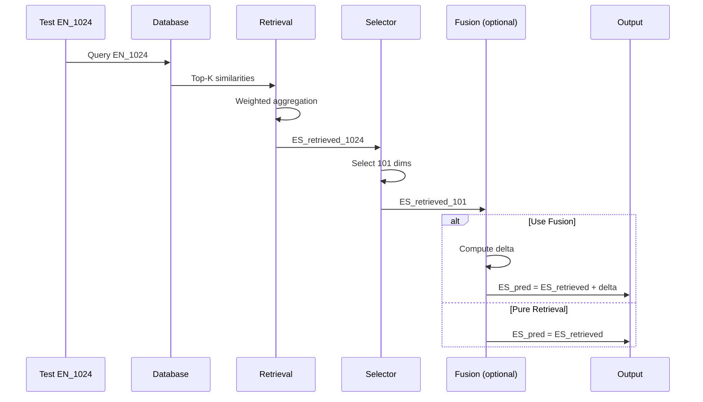

# R-APM 系统架构图

**Retrieval-Augmented Pragmatic Mapper** - Interspeech 2026 TOPI Challenge

本文档提供R-APM系统的详细架构图，包括Fusion网络（Correction Network）和完整的R-APM系统架构。

---

## 目录

1. [系统概述](#系统概述)
2. [架构图1：Fusion网络 (Correction Network)](#架构图1fusion网络-correction-network)
3. [架构图2：完整R-APM系统](#架构图2完整-r-apm-系统)
4. [组件详细说明](#组件详细说明)
5. [数据流](#数据流)
6. [参数配置](#参数配置)

---

## 系统概述

R-APM是一个跨语言韵律迁移系统，用于将英语的HuBERT特征映射到西班牙语的韵律特征。

### 核心组件

```
┌─────────────────────────────────────────────────────────────────┐
│                         R-APM System                             │
├─────────────────────────────────────────────────────────────────┤
│                                                                   │
│  ┌──────────────┐      ┌──────────────┐      ┌──────────────┐   │
│  │   Retrieval   │ ───→ │  Feature     │ ───→ │    Fusion     │   │
│  │    Module     │      │  Selection   │      │   (Optional)  │   │
│  └──────────────┘      └──────────────┘      └──────────────┘   │
│         │                       │                     │          │
│         ▼                       ▼                     ▼          │
│   Top-K Search          1024→101维         MLP Correction        │
│   + Softmax             (spanish_winners)   Network              │
│                                                                  │
└──────────────────────────────────────────────────────────────────┘
```

---

## 架构图1：Fusion网络 (Correction Network)

### 1.1 概览

Fusion网络（又称Correction Network）是一个多层感知机（MLP），用于学习英语特征与检索到的西班牙语特征之间的系统性偏差，并产生残差修正。

### 1.2 Mermaid架构图

```mermaid
graph TB
    subgraph "Input Layer"
        EN_1024[("EN_1024<br/>English Features<br/>📊 1024 dims")]
        ES_101[("ES_retrieved_101<br/>Retrieved Spanish<br/>📊 101 dims")]
    end

    subgraph "Concatenation"
        CONCAT["Concatenate<br/>┃━━━━━━━━┃<br/>1125 dims"]
    end

    subgraph "Hidden Layer 1"
        LN1["LayerNorm<br/>📏 1125 → 1125"]
        FC1["Linear<br/>⚡ 1125 → 256"]
        ACT1["GELU<br/>🎯 Activation"]
    end

    subgraph "Hidden Layer 2"
        LN2["LayerNorm<br/>📏 256 → 256"]
        FC2["Linear<br/>⚡ 256 → 128"]
        ACT2["GELU<br/>🎯 Activation"]
    end

    subgraph "Output Layer"
        FC_OUT["Linear<br/>⚡ 128 → 101<br/>⚠️ Zero-initialized"]
    end

    subgraph "Residual Connection"
        ADD["➕ Element-wise Add<br/>ES_pred = ES_retrieved + delta"]
    end

    subgraph "Output"
        OUTPUT[("ES_pred_101<br/>Final Prediction<br/>🎯 101 dims")]
    end

    EN_1024 --> CONCAT
    ES_101 --> CONCAT

    CONCAT --> LN1 --> FC1 --> ACT1 --> LN2 --> FC2 --> ACT2 --> FC_OUT

    FC_OUT --> ADD
    ES_101 --> ADD
    ADD --> OUTPUT

    style EN_1024 fill:#e1f5ff,stroke:#01579b,stroke-width:3px
    style ES_101 fill:#fff3e0,stroke:#e65100,stroke-width:3px
    style CONCAT fill:#f3e5f5,stroke:#7b1fa2,stroke-width:2px
    style FC1 fill:#e8f5e9,stroke:#2e7d32,stroke-width:2px
    style FC2 fill:#e8f5e9,stroke:#2e7d32,stroke-width:2px
    style FC_OUT fill:#ffebee,stroke:#c62828,stroke-width:2px
    style ADD fill:#fff9c4,stroke:#f57f17,stroke-width:3px
    style OUTPUT fill:#c8e6c9,stroke:#1b5e20,stroke-width:3px
```



### 1.3 伪代码

```python
# Fusion Network Forward Pass
def fusion_forward(EN_1024, ES_retrieved_101):
    # Step 1: Concatenate
    x = concat([EN_1024, ES_retrieved_101])  # (B, 1125)

    # Step 2: Layer 1
    x = LayerNorm(x)
    x = Linear(x, 1125 → 256)
    x = GELU(x)

    # Step 3: Layer 2
    x = LayerNorm(x)
    x = Linear(x, 256 → 128)
    x = GELU(x)

    # Step 4: Output
    delta = Linear(x, 128 → 101)  # Zero-initialized

    # Step 5: Residual Connection
    ES_pred = ES_retrieved_101 + delta

    return ES_pred, delta
```

### 1.4 层详细说明

| 层 | 输入维度 | 输出维度 | 参数量 | 说明 |
|-----|---------|----------|--------|------|
| Concat | - | 1125 | 0 | EN_1024 (1024) + ES_101 (101) |
| LayerNorm | 1125 | 1125 | 2250 | 归一化 |
| Linear | 1125 | 256 | 288,000 | 权重矩阵 |
| GELU | 256 | 256 | 0 | 激活函数 |
| LayerNorm | 256 | 256 | 512 | 归一化 |
| Linear | 256 | 128 | 32,896 | 权重矩阵 |
| GELU | 128 | 128 | 0 | 激活函数 |
| Linear (Output) | 128 | 101 | 13,029 | 零初始化 |
| **总计** | - | - | **334,949** | - |

### 1.5 关键设计

**零初始化策略**：
```python
# 最后一层权重和偏置初始化为0
nn.init.zeros_(output_layer.weight)
nn.init.zeros_(output_layer.bias)
```

**目的**: 训练开始时，`delta = 0`，因此 `ES_pred = ES_retrieved`。这意味着模型从纯检索的性能开始，Fusion网络逐渐学习系统性偏差。

---

## 架构图2：完整R-APM系统

### 2.1 概览

R-APM系统支持两种检索空间（1024维和103维）和两种模式（纯检索和带Fusion）。

### 2.2 Mermaid架构图（1024维模式）

```mermaid
graph TB
    subgraph "Input"
        QUERY[("Query<br/>EN_1024<br/>📤 1024 dims")]
    end

    subgraph "Retrieval Database"
        DB_EN["Database EN<br/>📚 2893 × 1024"]
        DB_ES["Database ES<br/>📚 2893 × 1024"]
    end

    subgraph "Retrieval Module"
        NORM1["L2 Normalize<br/>📏 query_norm"]
        NORM2["L2 Normalize<br/>📏 db_norm"]
        SIM["Cosine Similarity<br/>🔗 query·dbᵀ"]
        TOPK["Top-K Selection<br/>🎯 K=90"]
        SOFTMAX["Softmax Weighting<br/>🌡️ T=0.04"]
        AGGREGATE["Weighted Sum<br/>∑wᵢ·esᵢ"]
    end

    subgraph "Feature Selection"
        SELECT["Select 101 dims<br/>📌 spanish_winners"]
    end

    subgraph "Fusion Network Optional"
        FUSION["Fusion Network<br/>🔄 MLP 1125→256→128→101"]
        ADD["Residual Add<br/>➕ retrieved + delta"]
    end

    subgraph "Output"
        RESULT[("ES_pred_101<br/>📥 101 dims")]
    end

    QUERY --> NORM1
    DB_EN --> NORM2

    NORM1 --> SIM
    NORM2 --> SIM

    SIM --> TOPK --> SOFTMAX --> AGGREGATE

    DB_ES --> AGGREGATE

    AGGREGATE --> SELECT

    SELECT --> FUSION_DECISION{Use Fusion?}

    FUSION_DECISION -->|Yes| FUSION --> ADD --> RESULT
    FUSION_DECISION -->|No| RESULT

    style QUERY fill:#e1f5ff,stroke:#01579b,stroke-width:3px
    style DB_EN fill:#f3e5f5,stroke:#7b1fa2,stroke-width:2px
    style DB_ES fill:#f3e5f5,stroke:#7b1fa2,stroke-width:2px
    style SIM fill:#fff3e0,stroke:#e65100,stroke-width:2px
    style TOPK fill:#e8f5e9,stroke:#2e7d32,stroke-width:2px
    style SOFTMAX fill:#e8f5e9,stroke:#2e7d32,stroke-width:2px
    style SELECT fill:#ffebee,stroke:#c62828,stroke-width:2px
    style FUSION fill:#e1f5fe,stroke:#0277bd,stroke-width:2px
    style RESULT fill:#c8e6c9,stroke:#1b5e20,stroke-width:3px
```



### 2.3 Mermaid架构图（103维模式）

```mermaid
graph TB
    subgraph "Input"
        QUERY[("Query<br/>EN_1024<br/>📤 1024 dims")]
    end

    subgraph "Dimensionality Reduction"
        REDUCE_EN["Select 103 dims<br/>📌 english_winners<br/>1024→103"]
        REDUCE_ES["Select 103 dims<br/>📌 english_winners<br/>1024→103"]
    end

    subgraph "Retrieval Database 103-dim"
        DB_EN_103["Database EN<br/>📚 2893 × 103"]
        DB_ES_103["Database ES<br/>📚 2893 × 103"]
    end

    subgraph "Retrieval Module 103-dim"
        SIM_103["Cosine Similarity<br/>🔗 query·dbᵀ<br/>(103-dim space)"]
        TOPK_103["Top-K Selection<br/>🎯 K=90"]
        SOFTMAX_103["Softmax Weighting<br/>🌡️ T=0.04"]
        AGGREGATE_103["Weighted Sum<br/>∑wᵢ·esᵢ<br/>(1024-dim result)"]
    end

    subgraph "Feature Selection"
        SELECT_103["Select 101 dims<br/>📌 spanish_winners<br/>1024→101"]
    end

    subgraph "Fusion Network Optional"
        FUSION_103["Fusion Network<br/>🔄 MLP 1125→256→128→101"]
        ADD_103["Residual Add<br/>➕ retrieved + delta"]
    end

    subgraph "Output"
        RESULT_103[("ES_pred_101<br/>📥 101 dims")]
    end

    QUERY --> REDUCE_EN
    DB_EN -.->|"full 1024-dim"| REDUCE_ES

    REDUCE_EN --> DB_EN_103
    REDUCE_ES --> DB_ES_103

    DB_EN_103 --> SIM_103
    DB_ES_103 --> SIM_103

    SIM_103 --> TOPK_103 --> SOFTMAX_103 --> AGGREGATE_103

    AGGREGATE_103 --> SELECT_103

    SELECT_103 --> FUSION_DECISION_103{Use Fusion?}

    FUSION_DECISION_103 -->|Yes| FUSION_103 --> ADD_103 --> RESULT_103
    FUSION_DECISION_103 -->|No| RESULT_103

    style QUERY fill:#e1f5ff,stroke:#01579b,stroke-width:3px
    style REDUCE_EN fill:#fff9c4,stroke:#f57f17,stroke-width:2px
    style REDUCE_ES fill:#fff9c4,stroke:#f57f17,stroke-width:2px
    style SIM_103 fill:#fff3e0,stroke:#e65100,stroke-width:2px
    style SELECT_103 fill:#ffebee,stroke:#c62828,stroke-width:2px
    style RESULT_103 fill:#c8e6c9,stroke:#1b5e20,stroke-width:3px
```



### 2.4 检索过程详解

```python
# Retrieval Process Pseudocode
def retrieve(query_EN_1024, database_EN, database_ES, mode='1024'):
    # Step 1: Dimensionality reduction (103-dim mode only)
    if mode == '103':
        query = query_EN_1024[english_winners]  # 1024 → 103
        db_EN = database_EN[:, english_winners]  # 2893 × 103
    else:
        query = query_EN_1024  # 1024
        db_EN = database_EN     # 2893 × 1024

    # Step 2: Normalization
    query_norm = L2_normalize(query)
    db_norm = L2_normalize(db_EN)

    # Step 3: Similarity Computation
    similarities = query_norm @ db_norm.T  # (1, 2893)

    # Step 4: Top-K Selection
    top_k = 90
    top_k_sims, top_k_indices = topk(similarities, k=top_k)

    # Step 5: Softmax Weighting
    temperature = 0.04
    weights = softmax(top_k_sims / temperature)

    # Step 6: Weighted Aggregation
    ES_retrieved_1024 = sum(weights[i] * database_ES[top_k_indices[i]]
                           for i in range(top_k))

    # Step 7: Feature Selection (Spanish)
    ES_retrieved_101 = ES_retrieved_1024[spanish_winners]

    return ES_retrieved_101
```

### 2.5 系统模式对比

| 特性 | 1024_fusion | 1024_pure | 103_fusion | 103_pure |
|------|-------------|-----------|------------|---------|
| 检索空间 | 1024维 | 1024维 | 103维 | 103维 |
| Fusion网络 | ✅ | ❌ | ✅ | ❌ |
| 可训练参数 | 334,949 | 0 | 334,949 | 0 |
| 训练集性能 | 0.9999 | 0.9947 | 0.9991 | 0.9721 |

---

## 组件详细说明

### 3.1 SimpleRetrieval Module

**功能**: 执行基于余弦相似度的Top-K检索

**关键参数**:
- `top_k = 90`: 检索最相似的90个样本
- `temperature = 0.04`: Softmax温度参数（越小越锐化）

**数学公式**:

```
相似度: sᵢ = cosine(q, dbᵢ) = q·dbᵢ / (||q||·||dbᵢ||)
权重: wᵢ = exp(sᵢ/T) / Σⱼ exp(sⱼ/T)
检索结果: r = Σᵢ wᵢ · es_db[i]
```

### 3.2 FusionNetwork Module

**功能**: 学习EN特征和检索ES特征之间的系统性偏差

**架构**:
```
输入: [EN_1024, ES_retrieved_101] → Concat → 1125维
隐藏层: 1125 → 256 → 128
输出: 128 → 101 (delta)
最终: ES_pred = ES_retrieved + delta
```

### 3.3 特征选择

**Spanish Winners (101维)**:
- 来源: `official_mdekorte/feature_selection.py`
- 用途: 最终输出维度（比赛要求）
- 索引示例: `[41, 48, 67, 85, 151, ...]`

**English Winners (103维)**:
- 来源: `official_mdekorte/feature_selection.py`
- 用途: 103维检索空间的特征选择
- 索引示例: `[0, 2, 41, 54, 63, 67, ...]`

---

## 数据流

### 4.1 训练流程

```mermaid
sequenceDiagram
    participant Train as Training Data
    participant Model as R-APM Model
    participant Loss as Cosine Loss
    participant Opt as Optimizer

    Train->>Model: EN_1024, ES_101 (batch)
    Model->>Model: Retrieve ES_retrieved_101
    Model->>Model: Fusion → ES_pred_101
    Model->>Loss: ES_pred_101, ES_101
    Loss->>Model: 1 - cosine_similarity
    Model->>Opt: Gradients
    Opt->>Model: Updated parameters
```

### 4.2 推理流程



---

## 参数配置

### 5.1 最优超参数

| 参数 | 值 | 说明 |
|------|-----|------|
| `top_k` | 90 | 超参数搜索证实优于70 |
| `temperature` | 0.04 | Softmax锐化程度 |
| `hidden_dims` | [256, 128] | Fusion网络隐藏层 |
| `epochs` | 100 | 训练轮数 |
| `lr` | 0.001 | 学习率 |
| `weight_decay` | 1e-4 | L2正则化 |

### 5.2 模型变体

```python
# 1024维 + Fusion
model = RetrievalModel(mode='1024_fusion', top_k=90, temperature=0.04)

# 1024维 + Pure
model = RetrievalModel(mode='1024_pure', top_k=90, temperature=0.04)

# 103维 + Fusion
model = RetrievalModel(mode='103_fusion', top_k=90, temperature=0.04)

# 103维 + Pure
model = RetrievalModel(mode='103_pure', top_k=90, temperature=0.04)
```

---

## 文件结构

```
E:\interspeech2026\
├── src/
│   ├── train_ensemble.py          # 统一训练脚本
│   └── models/
│       ├── retrieval.py           # 检索模块
│       └── fusion.py              # Fusion网络
│
├── docs/
│   └── architecture_diagrams.md   # 本文档
│
├── checkpoints/
│   ├── model_1024_fusion.pth      # 1024维+Fusion
│   ├── model_1024_pure.pth        # 1024维纯检索
│   ├── model_103_fusion.pth       # 103维+Fusion
│   └── model_103_pure.pth         # 103维纯检索
│
└── submit/submissions/
    ├── submission_1024_fusion.zip
    ├── submission_1024_pure.zip
    ├── submission_103_fusion.zip
    └── submission_103_pure.zip
```

---

## 附录

### A. Mermaid渲染

上述架构图使用Mermaid语法编写，可在支持Mermaid的Markdown查看器中渲染：

- GitHub: 原生支持
- VS Code: 安装Markdown Preview Mermaid Support插件
- 在线工具: https://mermaid.live/

### B. 相关文档

- `docs/ensemble_training_report.md` - 训练实验报告
- `docs/hyperparameter_search_report.md` - 超参数搜索报告
- `system_description.md` - 系统描述论文
- `CLAUDE.md` - 项目概览

---

**文档版本**: 1.0
**创建日期**: 2026-01-29
**最后更新**: 2026-01-29
**维护者**: R-APM Team
